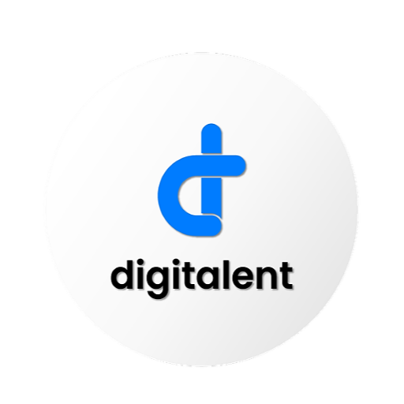

# FGA_DQLab_DE
 

  

 

  <a  href="https://digitalent.kominfo.go.id/">Digitalent</a> merupakan sebuah program dari kementrian komunikasi dan informatika yang bertujuan untuk meningkatkan keterampilan dan daya saing, produktivitas, profesionalisme SDM bidang teknologi informasi dan komunikasi bagi angkatan kerja muda Indonesia, masyarakat umum, dan aparatur sipil negara.

  Salah satu program digitalent yaitu Menjadi Data Engineer, bekerja sama dengan sebuah portal belajar data yaitu <a href="https://academy.dqlab.id/">DQLab</a> . Pelatihan tersebut mencerminkan studi kasus industri dan disusun oleh para praktisi data profesional. Pembelajaran dilakukan dengan metode <i>learning by doing</i> dengan fitur <i>live code editor</i> sehingga peserta dapat mengakses materi dengan mudah tanpa perlu instalasi software tambahan.

  Repositori ini berisi hasil belajar dari DQLab dengan modul yang telah disesuaikan oleh FGA Kominfo dengan tema "Data Engineer". Setiap foldernya akan berisis modul-modul beserta project yang dikerjakan guna menguji pemahaman peserta akan materi dari modul tersebut.

